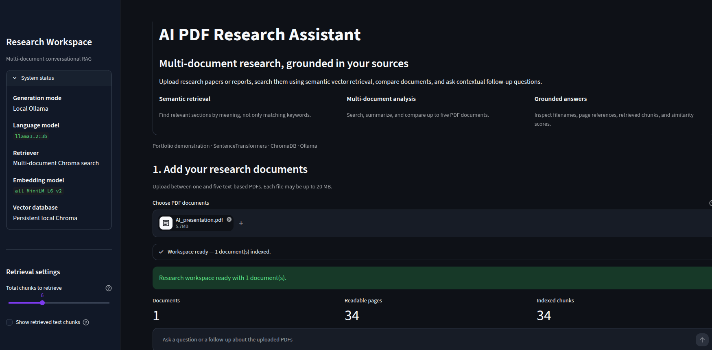
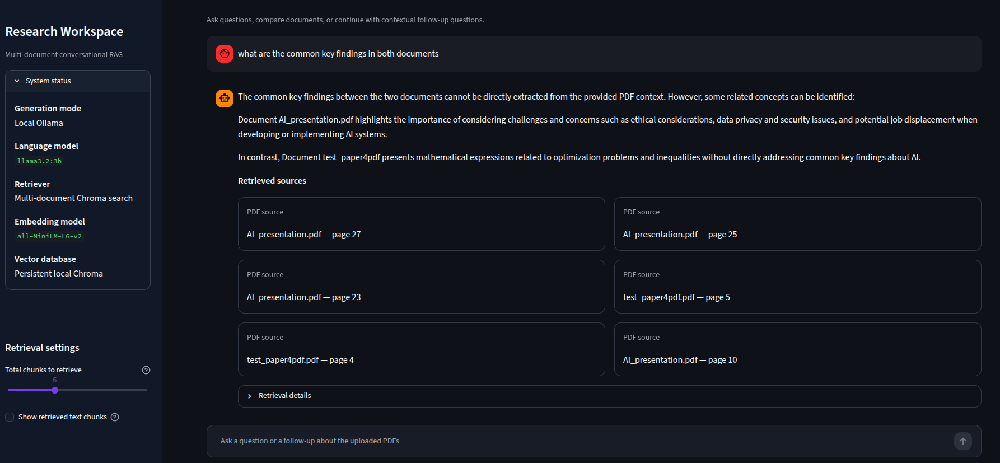

# AI PDF Research Assistant

## Live Demo

[Open the AI PDF Research Assistant](https://mg5991-ai-pdf-assistant.streamlit.app/)

An AI-powered, multi-document research assistant that lets users upload PDF documents, create semantic vector indexes, compare sources, and ask grounded follow-up questions through a conversational interface.

The application combines Retrieval-Augmented Generation (RAG), SentenceTransformers embeddings, ChromaDB vector search, Streamlit, and Ollama-based language models.

## Application Preview

### Multi-Document Research Workspace



### Grounded Answers with Document Sources



## Portfolio Highlights

This project demonstrates:

- multi-document Retrieval-Augmented Generation
- semantic embeddings with SentenceTransformers
- vector storage and retrieval with ChromaDB
- persistent local document indexes
- temporary deployment-safe public indexes
- PDF hashing and duplicate detection
- contextual conversational retrieval
- grounded answers with filename and page references
- local and cloud LLM integration through Ollama
- Streamlit deployment and interface design
- Docker and Docker Compose packaging
- persistent Docker volumes
- container health checks
- non-root container execution
- environment-based configuration
- secure secrets handling

## Features

- Upload up to five PDF documents
- Process multiple documents in one research session
- Extract text page by page
- Split PDF content into overlapping chunks
- Convert document chunks into semantic embeddings
- Store embeddings, text, filenames, page numbers, and metadata in ChromaDB
- Search across all uploaded documents
- Retrieve relevant sections by semantic meaning
- Reuse previously created document indexes in local mode
- Reuse persistent indexes inside Docker
- Identify PDFs using SHA-256 content hashes
- Detect and skip duplicate PDF content
- Limit each uploaded PDF to 20 MB
- Ask custom questions about uploaded documents
- Ask contextual follow-up questions
- Keep conversation history during the current session
- Compare methods, findings, and conclusions across documents
- Summarize uploaded documents
- Extract important findings and key points
- Display filename and page references
- Display semantic similarity scores
- Inspect retrieved text chunks and retrieval details
- Clear the current conversation
- Rebuild uploaded document indexes
- Run with local Ollama or Ollama Cloud
- Run locally with Python
- Run as a Docker container
- Persist ChromaDB indexes through Docker volumes
- Display application health through a container health check

## How It Works

```text
Multiple PDF uploads
        ↓
File validation and duplicate detection
        ↓
SHA-256 content hash for each document
        ↓
Check for existing ChromaDB collections
        ↓
Page-by-page text extraction
        ↓
Overlapping text chunks
        ↓
SentenceTransformer embeddings
        ↓
Document-specific ChromaDB indexes
        ↓
User question and recent chat context
        ↓
Semantic search across all uploaded documents
        ↓
Highest-ranking chunks from each document
        ↓
Local or cloud Ollama model
        ↓
Grounded conversational answer
        ↓
Filename and page references
```

## RAG Architecture

The application follows a multi-document conversational RAG pipeline:

1. The user uploads one or more PDF documents.
2. Each file is checked against the file-count and file-size limits.
3. A SHA-256 hash is calculated from the contents of each PDF.
4. Duplicate PDF content is detected using the generated hashes.
5. Each valid PDF is read page by page.
6. Extracted text is cleaned and divided into overlapping chunks.
7. Each chunk is converted into a 384-dimensional semantic embedding.
8. Embeddings, chunk text, filenames, page numbers, document hashes, and metadata are stored in ChromaDB.
9. Each PDF uses its own document-specific ChromaDB collection.
10. The user's question is combined with recent user questions when follow-up context is needed.
11. The retrieval query is converted into a semantic embedding.
12. ChromaDB searches each uploaded document for relevant chunks.
13. The strongest result from each document is retained before remaining retrieval positions are filled.
14. The selected PDF sections and recent conversation context are sent to the Ollama language model.
15. The generated answer is displayed with filename and page references.
16. Questions, answers, and sources remain visible during the current Streamlit session.

## Tech Stack

- Python 3.11
- Streamlit
- PyPDF
- SentenceTransformers
- `all-MiniLM-L6-v2`
- ChromaDB
- Ollama
- Llama 3.2 3B
- GPT-OSS through Ollama Cloud
- Docker
- Docker Compose
- Git
- GitHub
- Streamlit Community Cloud

## Generation Modes

The application automatically supports two generation modes.

### Local Ollama Mode

When `OLLAMA_API_KEY` is not configured, the application connects to a local Ollama server.

Default local endpoint outside Docker:

```text
http://localhost:11434
```

Default endpoint from inside Docker:

```text
http://host.docker.internal:11434
```

The local language model is:

```text
llama3.2:3b
```

In local mode:

- PDF text is extracted locally
- embeddings are generated locally
- vector indexes are stored locally
- questions and retrieved context are processed by the local Ollama model

### Ollama Cloud Mode

When `OLLAMA_API_KEY` is configured, the application connects to Ollama Cloud.

The deployed Streamlit version uses:

```text
gpt-oss:120b
```

The API key is provided through environment variables or Streamlit deployment secrets and is not stored in the repository.

In cloud mode, retrieved PDF sections and user questions are sent to the configured Ollama Cloud model for answer generation.

## Vector Database Modes

### Persistent Local ChromaDB

When the application runs locally, it can use a persistent ChromaDB database stored in:

```text
chroma_db/
```

Each PDF is identified using its SHA-256 content hash.

When the same PDF is uploaded again, the application checks whether its ChromaDB collection already contains the expected number of chunks. When the stored index is complete, it is reused instead of generating the embeddings again.

The `chroma_db/` directory is excluded from Git.

### Persistent Docker ChromaDB

The Docker Compose setup mounts a named volume at:

```text
/app/chroma_db
```

This allows document indexes to survive:

- container restarts
- application restarts
- container recreation
- Docker image rebuilds

The stored indexes remain available until the Docker volume is explicitly deleted.

### Temporary Public ChromaDB

The Streamlit Community Cloud deployment uses temporary ChromaDB storage.

Public indexes may be reused while the Streamlit process remains active, but they are not guaranteed to survive:

- application restarts
- inactivity shutdowns
- platform reboots
- redeployments
- infrastructure changes

A hosted vector database would be required for durable public persistence.

## Multi-Document Retrieval

The application searches each indexed PDF separately.

For every question:

1. The question is embedded using SentenceTransformers.
2. Every uploaded document collection is searched.
3. The highest-ranking result from each document is retained.
4. Remaining retrieval positions are filled using the strongest results across all documents.
5. Results are sorted by semantic similarity.
6. Selected chunks are passed to the language model.

This approach helps prevent one large document from completely dominating the retrieved context.

## Conversational Follow-Up Questions

The application keeps recent questions and answers in Streamlit Session State.

For short follow-up questions such as:

```text
Which one performed better?
```

the retrieval query can include recent user questions, helping the system understand what “which one” refers to.

Recent assistant answers are included only for conversational understanding. They are not treated as factual evidence. Uploaded PDF context remains the factual source.

Conversation history is temporary and belongs only to the current Streamlit session.

## Source References

Generated answers are instructed to cite important claims using this format:

```text
(filename.pdf, page 4)
```

The interface displays structured source cards containing filenames and page numbers from retrieved chunks.

Previous answers retain their source lists inside expandable sections.

Source references depend on the quality of extracted PDF text and retrieved chunks. Important information should still be checked against the original documents.

## User Interface

The interface includes:

- a professional dark theme
- a product overview section
- feature summary cards
- numbered workflow sections
- system and model status information
- retrieval configuration controls
- PDF-processing feedback
- document, page, and chunk metrics
- individual document status cards
- chat-style questions and answers
- structured source cards
- expandable retrieval details
- privacy and verification notices

The Streamlit theme is configured in:

```text
.streamlit/config.toml
```

## Project Structure

```text
ai-pdf-research-assistant/
├── .streamlit/
│   └── config.toml
├── assets/
│   ├── app-overview.png
│   └── multi-document-answer.png
├── app.py
├── requirements.txt
├── README.md
├── Dockerfile
├── compose.yaml
├── .dockerignore
├── .env.example
├── .gitignore
└── chroma_db/          # Generated locally and ignored by Git
```

## Local Installation

### 1. Clone the repository

```bash
git clone https://github.com/MG5991/ai-pdf-research-assistant.git
cd ai-pdf-research-assistant
```

### 2. Create a virtual environment

```bash
python3 -m venv .venv
```

### 3. Activate the virtual environment

```bash
source .venv/bin/activate
```

### 4. Upgrade pip

```bash
python -m pip install --upgrade pip
```

### 5. Install dependencies

```bash
python -m pip install -r requirements.txt
```

The SentenceTransformers embedding model is downloaded automatically the first time the application runs.

## Python Dependencies

The current `requirements.txt` contains:

```text
streamlit>=1.50
pypdf
ollama>=0.6.2
sentence-transformers
chromadb
```

## Install Ollama for Local Mode

Install Ollama on Linux:

```bash
curl -fsSL https://ollama.com/install.sh | sh
```

Start Ollama:

```bash
sudo systemctl start ollama
```

Enable Ollama at system startup:

```bash
sudo systemctl enable ollama
```

Download the local language model:

```bash
ollama pull llama3.2:3b
```

Confirm that the model is available:

```bash
ollama list
```

You should see:

```text
llama3.2:3b
```

## Run the Application Locally

```bash
python -m streamlit run app.py
```

Open:

```text
http://localhost:8501
```

The sidebar should display information similar to:

```text
Generation mode: Local Ollama
Language model: llama3.2:3b
Retriever: Multi-document Chroma search
Embedding model: all-MiniLM-L6-v2
Vector database: Persistent Chroma
```

## Run Locally with Ollama Cloud

Load the API key into the current terminal without saving it in the repository:

```bash
read -s -p "Ollama Cloud API key: " OLLAMA_API_KEY
export OLLAMA_API_KEY
echo
```

Then run:

```bash
python -m streamlit run app.py
```

Do not place the real API key inside:

- `app.py`
- `README.md`
- `.env.example`
- `requirements.txt`
- screenshots
- Git commits
- committed configuration files

## Docker

The application includes production-style Docker packaging with:

- a Python 3.11 slim base image
- a non-root application user
- a Streamlit health check
- persistent ChromaDB storage
- persistent SentenceTransformers model caching
- local and cloud Ollama support
- Docker Compose orchestration
- localhost-only port binding
- excluded secrets, virtual environments, and generated files

## Docker Files

```text
Dockerfile
compose.yaml
.dockerignore
.env.example
```

## Build the Docker Image

```bash
docker compose build
```

Confirm the image was created:

```bash
docker images | grep ai-pdf-research-assistant
```

## Run Docker with Local Ollama

Make sure Ollama is running on the Ubuntu host:

```bash
sudo systemctl start ollama
ollama list
```

The Docker container connects to the host Ollama service through:

```text
http://host.docker.internal:11434
```

On Linux, Ollama must listen on an address that is reachable from the Docker network.

Create a systemd override:

```bash
sudo systemctl edit ollama
```

Add:

```ini
[Service]
Environment="OLLAMA_HOST=0.0.0.0:11434"
```

Then restart Ollama:

```bash
sudo systemctl daemon-reload
sudo systemctl restart ollama
```

Confirm that Ollama is listening:

```bash
sudo ss -ltnp | grep 11434
```

Start the application container:

```bash
unset OLLAMA_API_KEY
docker compose up -d
```

Open:

```text
http://localhost:8501
```

The application port is bound to localhost only:

```text
127.0.0.1:8501
```

Do not expose Ollama port `11434` publicly.

## Run Docker with Ollama Cloud

Load the API key into the current terminal:

```bash
read -s -p "Ollama Cloud API key: " OLLAMA_API_KEY
export OLLAMA_API_KEY
echo
```

Start or recreate the container:

```bash
docker compose up -d --force-recreate
```

Confirm that the variable is available inside the container without displaying its value:

```bash
docker compose exec app python -c "import os; print('API key available:', bool(os.getenv('OLLAMA_API_KEY')))"
```

Expected:

```text
API key available: True
```

## Check Docker Status

```bash
docker compose ps
```

Immediately after startup, the container may show:

```text
health: starting
```

Wait until Streamlit has finished loading:

```bash
sleep 20
docker compose ps
```

The container should eventually show:

```text
healthy
```

## Check the Streamlit Health Endpoint

```bash
curl \
  --retry 10 \
  --retry-all-errors \
  --retry-delay 3 \
  http://localhost:8501/_stcore/health
```

Expected response:

```text
ok
```

## View Docker Logs

```bash
docker compose logs -f app
```

Press `Ctrl+C` to stop viewing logs. The container will continue running.

To view only recent logs:

```bash
docker compose logs --tail=100 app
```

## Test Local Ollama Connectivity from Docker

```bash
docker compose exec -T app python - <<'PY'
import json
import urllib.request

url = "http://host.docker.internal:11434/api/tags"

with urllib.request.urlopen(url, timeout=10) as response:
    data = json.load(response)

models = [
    model.get("name")
    for model in data.get("models", [])
]

print("Container connected to Ollama.")
print("Available models:", models)
PY
```

Expected output should include:

```text
Container connected to Ollama.
Available models: ['llama3.2:3b', ...]
```

## Persistent Docker Storage

Docker Compose creates named volumes for:

```text
ChromaDB vector indexes
SentenceTransformers model cache
```

This allows indexes and downloaded embedding models to survive container restarts.

Restart the application:

```bash
docker compose restart app
```

After restarting, uploading the same PDF should show:

```text
Index reused
```

List the volumes:

```bash
docker volume ls | grep -E "chroma|model"
```

## Stop Docker Safely

Stop the application without deleting stored data:

```bash
docker compose down
```

The named volumes remain available.

To intentionally delete the stored indexes and model cache:

```bash
docker compose down -v
```

Use `-v` only when the stored Docker data should be permanently removed.

## Environment Variables

| Variable | Purpose | Default |
|---|---|---|
| `OLLAMA_API_KEY` | Enables Ollama Cloud mode | Empty |
| `OLLAMA_HOST` | Ollama endpoint used by the application | `http://localhost:11434` outside Docker |
| `CHROMA_DIRECTORY` | ChromaDB storage path | `chroma_db` outside Docker |
| `CHROMA_PERSISTENT` | Enables persistent ChromaDB storage | Automatically selected outside Docker |
| `HF_HOME` | Hugging Face model-cache directory | Environment dependent |

The Docker Compose configuration uses:

```text
OLLAMA_HOST=http://host.docker.internal:11434
CHROMA_DIRECTORY=/app/chroma_db
CHROMA_PERSISTENT=true
HF_HOME=/home/appuser/.cache/huggingface
```

Never commit real API keys, `.env` files, Streamlit secrets, or generated database contents.

## Deployment

The public version is deployed using Streamlit Community Cloud.

Deployment configuration:

```text
Repository: MG5991/ai-pdf-research-assistant
Branch: main
Main file: app.py
```

The Ollama Cloud API key is configured through Streamlit deployment secrets:

```toml
OLLAMA_API_KEY = "your_private_ollama_api_key"
```

The real API key must never be committed to GitHub.

## Using the Application

### Upload Documents

Upload between one and five text-based PDF documents.

Each PDF must be no larger than:

```text
20 MB
```

Duplicate PDF content is detected and skipped.

### Ask Custom Questions

Examples:

- What is the main topic of each uploaded document?
- What research gap does each paper address?
- Which documents use machine learning?
- What methods were used in each study?
- Which model achieved the best result?
- What are the main findings?
- What limitations are discussed?
- How do the conclusions differ?
- Which document provides stronger experimental evidence?

### Ask Follow-Up Questions

Examples:

- Which one performed better?
- What dataset did it use?
- How was that method evaluated?
- Did the other paper use the same approach?
- What limitations did the authors mention?

### Use Quick Actions

The interface provides three quick actions:

- **Summarize documents**
- **Compare documents**
- **Extract key points**

### Manage the Research Session

The sidebar includes controls to:

- clear the current conversation
- rebuild uploaded document indexes
- adjust the number of retrieved chunks
- display retrieved text chunks
- inspect document and index statistics

## Example Multi-Document Workflow

```text
Upload paper_a.pdf and paper_b.pdf

Question:
What is the main topic of each document?

Follow-up:
Which one uses machine learning?

Follow-up:
What model does it use?

Comparison:
Compare their methods, findings, and limitations.
```

## Semantic Vector Retrieval

The current version uses:

- page-based PDF extraction
- character-based overlapping chunks
- SentenceTransformers document embeddings
- SentenceTransformers query embeddings
- normalized 384-dimensional vectors
- ChromaDB cosine-distance search
- adjustable top-k retrieval
- document-specific vector collections
- filename and page metadata
- SHA-256 document identification
- duplicate-document detection
- persistent local index reuse
- persistent Docker index reuse
- temporary public indexes
- multi-document result merging
- follow-up query enrichment
- retrieval similarity scores
- index rebuilding controls

Unlike keyword-based retrieval, semantic embeddings can connect phrases with similar meanings even when they do not contain the same words.

For example:

```text
Question:
Which model performed best?

Document:
Shrinkage-LDA achieved the highest classification accuracy.
```

Semantic vector retrieval can recognize that these statements are related.

## Index Reuse

Each ChromaDB collection name is generated using:

```text
PDF content hash + index version
```

An existing index is reused when:

- the same PDF content is uploaded again
- a compatible collection already exists
- the stored chunk count matches the expected chunk count

An index is rebuilt when:

- no collection exists
- the stored collection is incomplete
- the user selects the rebuild option
- the index version changes
- the chunking strategy changes
- the embedding strategy changes

## File Protection

The application applies the following upload rules:

```text
Maximum files per session: 5
Maximum size per PDF: 20 MB
Accepted format: PDF
Duplicate content: skipped
Scanned PDFs without extractable text: skipped
```

These restrictions help reduce memory usage, processing time, and accidental resource abuse.

## Security

The repository is configured to exclude:

- `.env` files
- Streamlit secrets
- API keys
- private key files
- local ChromaDB data
- Python virtual environments
- Git metadata from Docker builds
- IDE configuration files
- temporary files and logs

The Docker container runs as a non-root user.

The Streamlit port is published only to:

```text
127.0.0.1:8501
```

Real API keys should be passed through the current shell, deployment secrets, or a dedicated secrets-management system.

## Current Limitations

- The application supports a maximum of five PDFs per session
- Each PDF is limited to 20 MB
- It works primarily with text-based PDFs
- Scanned or image-based PDFs require OCR
- Chat history exists only in the current Streamlit session
- Chat history disappears when the session is closed or reset
- Public vector indexes are temporary
- Local indexes remain only on the machine where they were created
- Follow-up context uses recent conversation turns rather than permanent memory
- Retrieval searches document text but does not directly analyze images, charts, or diagrams
- Source references depend on the quality of extracted text and retrieved chunks
- The local 3B language model may occasionally produce awkward wording
- Large or complex PDFs may require additional processing time and memory
- The retrieval system does not include a cross-encoder reranker
- The application does not provide user accounts or private document libraries
- Public users consume the application's Ollama Cloud allowance
- The public deployment is a portfolio demonstration rather than a high-scale production service

## Privacy

### Local Mode

When local Ollama mode is used:

- PDFs are processed on the user's computer
- text extraction happens locally
- embeddings are generated locally
- vectors are stored locally
- questions and retrieved PDF context are processed by the local Ollama model

### Docker Local Mode

When Docker is used with local Ollama:

- the application runs inside the container
- PDF extraction and embedding generation happen inside the container
- vector indexes are stored in a Docker volume
- language-model generation is handled by Ollama running on the host machine

### Cloud Mode

When Ollama Cloud mode is used:

- PDF extraction and embedding generation happen inside the running application
- retrieved PDF chunks and user questions are sent to the configured Ollama Cloud model
- public vector indexes are temporary
- chat history is stored only in the current Streamlit session

Users should not upload confidential, private, legally restricted, or sensitive documents to the public demonstration application.

## Planned Improvements

- hosted vector database integration
- durable public vector-index persistence
- automated RAG evaluation
- retrieval-quality testing
- answer-faithfulness evaluation
- unit and integration tests
- GitHub Actions CI/CD
- cross-encoder reranking
- hybrid keyword and semantic retrieval
- query rewriting
- improved citation verification
- OCR for scanned PDFs
- image, chart, and table extraction
- user authentication
- private document libraries
- saved conversations
- export answers to Markdown or Word
- usage analytics and monitoring
- rate limiting and abuse protection

## Disclaimer

AI-generated answers may contain mistakes, incomplete interpretations, or incorrect citations.

Users should verify important findings, numerical results, references, and conclusions against the original uploaded documents.